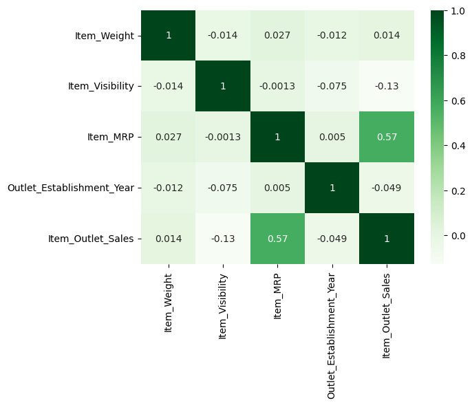
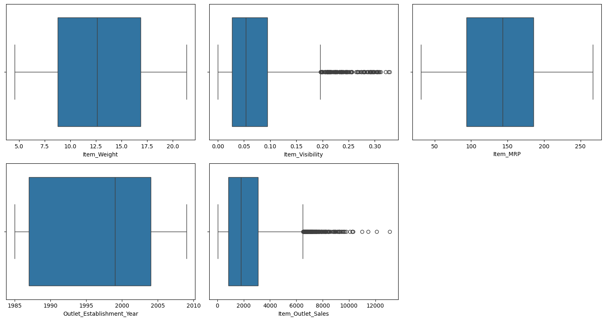

# Prediction_of_Product_Sales

This project focuses on the cleaning & analysis of product sales, leveraging a dataset that encompasses various item and outlet characteristics.

### Data Preparation and Cleaning

The initial phase involved a meticulous process of data loading, inspection, and cleaning to ensure data quality and readiness for analysis. Key steps undertaken include:

- **Handling Missing Data**: Strategic imputation of missing `Item_Weight` values using the median, and assigning a unique placeholder (-1) to absent `Outlet_Size` entries.
- **Standardizing Categorical Features**: Rectifying inconsistencies within the `Item_Fat_Content` column by normalizing varied representations (e.g., 'LF', 'reg', 'low fat') into consistent categories ('Low Fat' or 'Regular').
- **Type Conversion**: Verifying and adjusting data types across all columns to optimize for subsequent analytical and modeling tasks.

### Exploratory Data Analysis (EDA)

Extensive Exploratory Data Analysis was conducted to unveil underlying data distributions, inter-variable relationships, and potential patterns or anomalies. This involved:

- **Distribution Analysis**: Visualizing the spread and central tendency of numerical features (`Item_Weight`, `Item_Visibility`, `Item_MRP`, `Outlet_Establishment_Year`, `Item_Outlet_Sales`) through histograms and boxplots.
- **Categorical Insights**: Examining the frequency and composition of categorical variables (`Item_Fat_Content`, `Item_Type`, `Outlet_Size`, `Outlet_Location_Type`, `Outlet_Type`) using informative countplots.
- **Correlation Assessment**: Utilizing a heatmap to quantify and visualize the linear relationships between numerical attributes, notably identifying a significant positive correlation between `Item_MRP` and `Item_Outlet_Sales`.
- 
### Key Visualizations

#### 1. Correlation Heatmap

The heatmap shows a strong positive correlation between `Item_MRP` and `Item_Outlet_Sales`.

#### 2. Boxplot of Sales

The boxplot reveals the presence of outliers in `Item_Outlet_Sales` & `Item_Visibility`.
